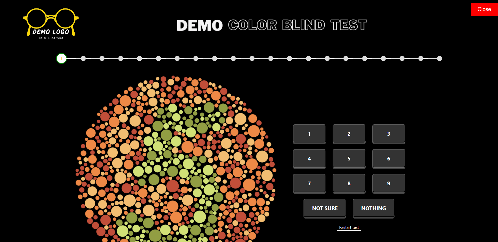
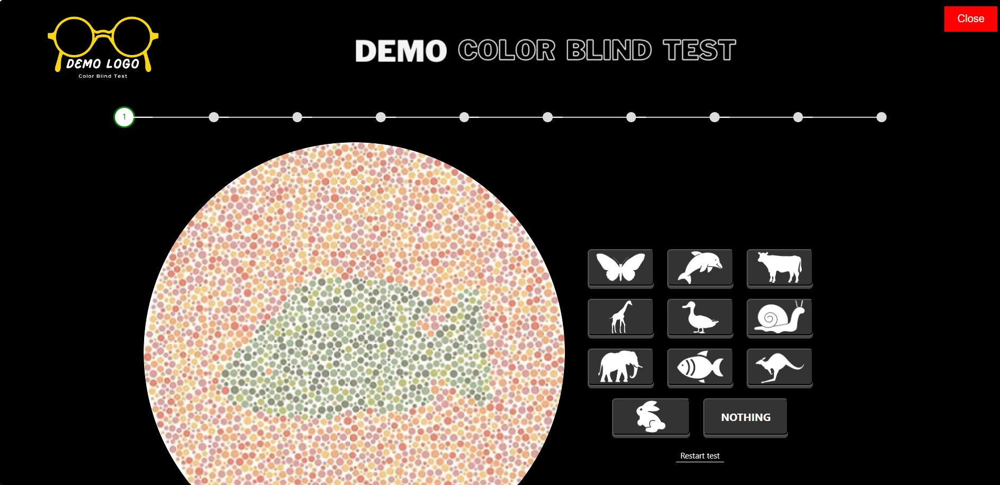

# Color Blind Test for Adults and Kids

This repository contains a web-based color blind test application designed for both adults and kids. The application provides an interactive test where users answer questions to evaluate color blindness by identifying numbers or animal shapes within images.

## Features

- **Two Versions**: 
  - **Adult Test**: Uses number-based images.
  - **Kids Test**: Uses fun animal-based images.
- **Animated Image Transitions**: Smooth animations when new images are loaded in the kids' test.
- **Interactive UI**: Users receive immediate feedback after each answer, and a progress bar shows their progress throughout the test.
- **Results Summary**: Displays the number of correct answers at the end of the test.
- **Restart Option**: Users can restart the test at any time.
- **Popup Navigation**: The tests are loaded inside a fullscreen popup when selected from the main page.

## Demo

You can see the project in action by visiting [Demo URL] (replace with the demo link if available).

## File Structure

- **index.html**: The main page that allows users to select between the adult and kids color blind tests.
- **index1.html**: The color blind test for adults, featuring number-based questions.
- **index2.html**: The color blind test for kids, featuring animal-based questions with animations.

## Installation

1. Clone the repository:
   ```bash
   git clone https://github.com/your-username/color-blind-test.git
   ```

2. Navigate to the project directory:
   ```bash
   cd color-blind-test
   ```

3. Open the `index.html` file in your browser to run the application.

## Usage

1. Open `index.html` in your browser.
2. Select either the **Adult Test** or **Kids Test** by clicking the corresponding button.
3. For the **Adult Test**:
   - You will be shown a series of images with numbers.
   - Click the correct number or select "Not Sure" or "Nothing" if you can't see it.
4. For the **Kids Test**:
   - You will be shown a series of images with animals.
   - Click the correct animal image that matches the question.
5. A progress bar will show your progress, and results will be displayed after all questions are answered.
6. You can restart the test at any time using the **Restart Test** button.

## Technologies Used

- **HTML5**
- **CSS3** (including keyframe animations)
- **JavaScript**
- **Bootstrap 5**

## Screenshots




## License

This project is licensed under the MIT License - see the [LICENSE](LICENSE) file for details.
